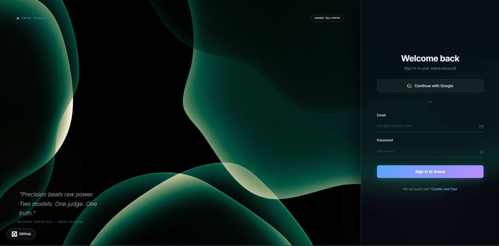
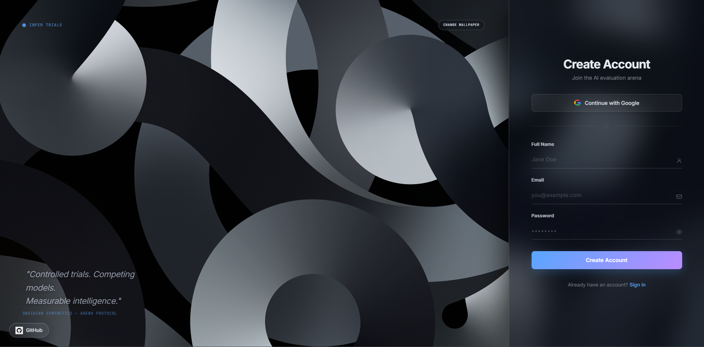
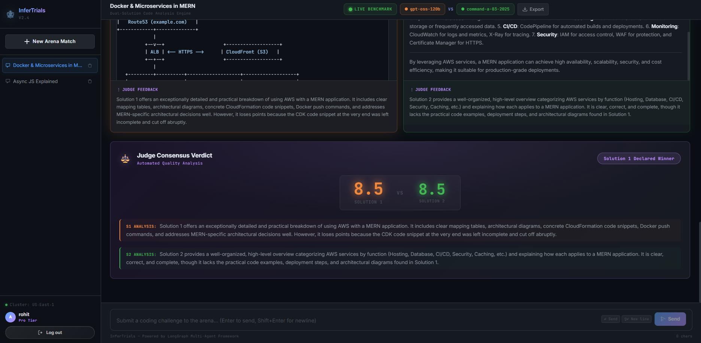

# **InferTrials**

**InferTrials** is a full-stack AI coding challenge arena. Users submit a programming problem, the backend sends it through a LangGraph-powered dual-model workflow, two independent solutions are generated, and an automated judge scores and explains the result.

The project combines a React/Vite dashboard, an Express/TypeScript API, MongoDB persistence, Redis-backed token logout protection, Google OAuth, and LangChain/LangGraph model orchestration.

## Screenshots


### Login Page



### Register Page



### Main Dashboard



## Features

- **Secure authentication:** email/password accounts, Google OAuth, JWT cookie sessions, protected dashboard routing, and Redis-backed token blacklisting on logout.
- **Arena-based AI workflow:** every coding prompt is evaluated through a LangGraph/LangChain pipeline that generates two independent answers, one from Groq and one from Cohere, with optional Tavily web search for current or external context.
- **Automated judging:** a dedicated judge agent scores both solutions from 0 to 10, provides concise feedback for each answer, and highlights the winning response in the dashboard.
- **Persistent chat workspace:** users can create new arena matches, resume saved chats, preserve conversation context across turns, delete chats, and rely on automatic AI-generated chat titles with a fallback title system.
- **Polished developer-focused UI:** the dashboard includes loading/progress states, markdown rendering, syntax-highlighted code blocks, copy-to-clipboard support, JSON chat export, responsive styling, and dedicated login/register screens.
- **REST API foundation:** the backend exposes endpoints for authentication, Google OAuth, user lookup, chat listing, message loading, arena invocation, and chat deletion.

## Architecture

The application flow diagram is also available as a standalone Mermaid source file at `docs/application-flow.mmd`.

```mermaid
flowchart TD

subgraph group_client["React dashboard"]
  node_client_entry["Vite client entry<br/>React entry<br/>[main.jsx]"]
  node_client_shell["App shell &amp; routing<br/>React application<br/>[App.jsx]"]
  node_workspace["Chat workspace<br/>dashboard layout<br/>[MainLayout.jsx]"]
  node_chat_ui["Chat and arena results<br/>React components<br/>[ArenaResponse.jsx]"]
  node_auth_client["Client auth guard<br/>auth state<br/>[auth.provider.jsx]"]
  node_auth_api_client["Cookie API client<br/>frontend API<br/>[auth.api.js]"]
end

subgraph group_api["Express API"]
  node_server["Node API entry<br/>Express runtime<br/>[server.ts]"]
  node_app["API composition<br/>Express app<br/>[app.ts]"]
  node_auth_routes["Authentication API<br/>routes &amp; controller<br/>[auth.routes.ts]"]
  node_auth_service["Token &amp; password service<br/>auth service<br/>[auth.service.ts]"]
  node_auth_middleware["Session enforcement<br/>JWT middleware<br/>[auth.middleware.ts]"]
  node_chat_api["Chat API<br/>routes &amp; controller<br/>[chat.controller.ts]"]
  node_title_service["Title generator<br/>chat service<br/>[title.service.ts]"]
end

subgraph group_arena["AI arena"]
  node_arena_graph{{"Arena workflow<br/>LangGraph workflow<br/>[graph.ai.ts]"}}
  node_model_factory["Model provider factory<br/>AI provider config<br/>[model.ai.ts]"]
  node_solution_models["Independent solutions<br/>Groq + Cohere"]
  node_gemini_judge["Gemini judge<br/>scoring model"]
end

subgraph group_data["State &amp; external systems"]
  node_chat_store[("Users, chats &amp; messages<br/>Mongoose models<br/>[message.model.ts]")]
  node_mongo[("MongoDB<br/>database<br/>[database.ts]")]
  node_redis[("Redis blacklist<br/>cache<br/>[cache.ts]")]
  node_google_oauth["Google OAuth<br/>optional identity provider<br/>[passport.ts]"]
  node_tavily["Tavily context<br/>optional web context"]
end

node_client_entry -->|"boots"| node_client_shell
node_client_shell -->|"guards routes"| node_auth_client
node_client_shell -->|"renders"| node_workspace
node_workspace -->|"shows active results"| node_chat_ui
node_auth_client -->|"uses"| node_auth_api_client
node_workspace -->|"submits cookie requests"| node_auth_api_client
node_auth_api_client -->|"HTTPS with cookies"| node_server
node_server -->|"starts"| node_app
node_app -->|"mounts"| node_auth_routes
node_app -->|"mounts"| node_chat_api
node_auth_routes -->|"issues credentials"| node_auth_service
node_auth_routes -.->|"OAuth strategy"| node_google_oauth
node_auth_service -->|"records logout revocation"| node_redis
node_chat_api -->|"protected by"| node_auth_middleware
node_auth_middleware -->|"checks revocation"| node_redis
node_chat_api -->|"loads and persists history"| node_chat_store
node_chat_store -->|"Mongoose persistence"| node_mongo
node_chat_api -->|"creates chat titles"| node_title_service
node_chat_api -->|"invokes with context"| node_arena_graph
node_arena_graph -->|"parallel solution stage"| node_solution_models
node_arena_graph -->|"judge stage"| node_gemini_judge
node_model_factory -->|"constructs providers"| node_solution_models
node_model_factory -->|"constructs provider"| node_gemini_judge
node_arena_graph -.->|"optional external context"| node_tavily
node_arena_graph -->|"serialized result"| node_chat_api

click node_client_entry "https://github.com/melloxprog/langgraph-ai-arena/blob/main/Frontend/src/main.jsx"
click node_client_shell "https://github.com/melloxprog/langgraph-ai-arena/blob/main/Frontend/src/app/App.jsx"
click node_workspace "https://github.com/melloxprog/langgraph-ai-arena/blob/main/Frontend/src/app/layouts/MainLayout.jsx"
click node_chat_ui "https://github.com/melloxprog/langgraph-ai-arena/blob/main/Frontend/src/app/components/ArenaResponse.jsx"
click node_auth_client "https://github.com/melloxprog/langgraph-ai-arena/blob/main/Frontend/src/features/auth/auth.provider.jsx"
click node_auth_api_client "https://github.com/melloxprog/langgraph-ai-arena/blob/main/Frontend/src/features/auth/services/auth.api.js"
click node_server "https://github.com/melloxprog/langgraph-ai-arena/blob/main/Backend/server.ts"
click node_app "https://github.com/melloxprog/langgraph-ai-arena/blob/main/Backend/src/app.ts"
click node_auth_routes "https://github.com/melloxprog/langgraph-ai-arena/blob/main/Backend/src/routes/auth.routes.ts"
click node_auth_service "https://github.com/melloxprog/langgraph-ai-arena/blob/main/Backend/src/services/auth.service.ts"
click node_auth_middleware "https://github.com/melloxprog/langgraph-ai-arena/blob/main/Backend/src/middlewares/auth.middleware.ts"
click node_chat_api "https://github.com/melloxprog/langgraph-ai-arena/blob/main/Backend/src/controllers/chat.controller.ts"
click node_chat_store "https://github.com/melloxprog/langgraph-ai-arena/blob/main/Backend/src/models/message.model.ts"
click node_title_service "https://github.com/melloxprog/langgraph-ai-arena/blob/main/Backend/src/services/title.service.ts"
click node_arena_graph "https://github.com/melloxprog/langgraph-ai-arena/blob/main/Backend/src/services/ai/graph.ai.ts"
click node_model_factory "https://github.com/melloxprog/langgraph-ai-arena/blob/main/Backend/src/services/ai/model.ai.ts"
click node_mongo "https://github.com/melloxprog/langgraph-ai-arena/blob/main/Backend/src/config/database.ts"
click node_redis "https://github.com/melloxprog/langgraph-ai-arena/blob/main/Backend/src/config/cache.ts"
click node_google_oauth "https://github.com/melloxprog/langgraph-ai-arena/blob/main/Backend/src/config/passport.ts"
click node_tavily "https://github.com/melloxprog/langgraph-ai-arena/blob/main/Backend/src/services/internet.service.ts"

classDef toneNeutral fill:#f8fafc,stroke:#334155,stroke-width:1.5px,color:#0f172a
classDef toneBlue fill:#dbeafe,stroke:#2563eb,stroke-width:1.5px,color:#172554
classDef toneAmber fill:#fef3c7,stroke:#d97706,stroke-width:1.5px,color:#78350f
classDef toneMint fill:#dcfce7,stroke:#16a34a,stroke-width:1.5px,color:#14532d
classDef toneRose fill:#ffe4e6,stroke:#e11d48,stroke-width:1.5px,color:#881337
classDef toneIndigo fill:#e0e7ff,stroke:#4f46e5,stroke-width:1.5px,color:#312e81
classDef toneTeal fill:#ccfbf1,stroke:#0f766e,stroke-width:1.5px,color:#134e4a
class node_client_entry,node_client_shell,node_workspace,node_chat_ui,node_auth_client,node_auth_api_client toneBlue
class node_server,node_app,node_auth_routes,node_auth_service,node_auth_middleware,node_chat_api,node_title_service toneAmber
class node_arena_graph,node_model_factory,node_solution_models,node_gemini_judge toneMint
class node_chat_store,node_mongo,node_redis,node_google_oauth,node_tavily toneRose
```



## Tech Stack

| Layer | Technology |
| --- | --- |
| Frontend | React 19, Vite 7, React Router, Axios, Tailwind CSS, SCSS |
| Backend | Node.js, Express 5, TypeScript, tsx |
| AI orchestration | LangGraph, LangChain |
| AI providers | Groq, Cohere, Google Generative AI, Mistral AI |
| Search tool | Tavily |
| Database | MongoDB, Mongoose |
| Cache/session security | Redis, ioredis |
| Authentication | JWT cookies, bcryptjs, Passport Google OAuth |
| Markdown/code rendering | Custom markdown renderer, highlight.js |

## Folder Structure

```text
langgraph-ai-arena/
|-- Backend/
|   |-- server.ts
|   |-- package.json
|   |-- tsconfig.json
|   `-- src/
|       |-- app.ts
|       |-- config/
|       |   |-- cache.ts
|       |   |-- config.ts
|       |   |-- database.ts
|       |   `-- passport.ts
|       |-- controllers/
|       |   |-- auth.controller.ts
|       |   `-- chat.controller.ts
|       |-- middlewares/
|       |   `-- auth.middleware.ts
|       |-- models/
|       |   |-- chat.model.ts
|       |   |-- message.model.ts
|       |   `-- user.model.ts
|       |-- routes/
|       |   |-- auth.routes.ts
|       |   `-- chat.routes.ts
|       |-- services/
|       |   |-- ai/
|       |   |   |-- graph.ai.ts
|       |   |   `-- model.ai.ts
|       |   |-- auth.service.ts
|       |   |-- internet.service.ts
|       |   `-- title.service.ts
|       `-- types/
|           `-- express.d.ts
|-- Frontend/
|   |-- index.html
|   |-- package.json
|   |-- vite.config.js
|   |-- public/
|   |   |-- ai-arena-logo.svg
|   |   |-- google-g-logo-white.svg
|   |   |-- logo.jpeg
|   |   `-- logo_reverse.jpeg
|   `-- src/
|       |-- main.jsx
|       |-- index.css
|       |-- app/
|       |   |-- App.jsx
|       |   |-- layouts/
|       |   |   `-- MainLayout.jsx
|       |   `-- components/
|       |       |-- ArenaResponse.jsx
|       |       |-- ChatArea.jsx
|       |       |-- ChatInput.jsx
|       |       |-- LoadingResponse.jsx
|       |       |-- MarkdownContent.jsx
|       |       |-- ScoreBadge.jsx
|       |       |-- Sidebar.jsx
|       |       |-- Toast.jsx
|       |       `-- UserMessage.jsx
|       `-- features/
|           `-- auth/
|               |-- auth.context.jsx
|               |-- auth.provider.jsx
|               |-- components/
|               |-- hooks/
|               |-- pages/
|               |-- services/
|               `-- styles/
`-- README.md
```

## Prerequisites

Install these before running the project locally:

- Node.js 20 or newer.
- npm.
- MongoDB database, either local or hosted.
- Redis server, local or hosted.
- API keys for the enabled AI providers.

At minimum, the current arena flow needs:

- `GROQ_API_KEY`
- `COHERE_API_KEY`
- `GOOGLE_API_KEY`
- `MONGO_URI`
- Redis connection details
- `JWT_SECRET`

Optional integrations:

- `TAVILY_API_KEY` enables internet search inside the Groq solution agent.
- `GOOGLE_CLIENT_ID`, `GOOGLE_CLIENT_SECRET`, and `GOOGLE_CALLBACK_URL` enable Google OAuth.
- `MISTRAL_API_KEY` is configured in the model service for future/alternate model usage.

## First-Time Setup

### 1. Clone the repository

```bash
git clone <your-repository-url>
cd langgraph-ai-arena
```

### 2. Install backend dependencies

```bash
cd Backend
npm install
```

### 3. Create the backend environment file

Create `Backend/.env`.

```env
PORT=3000
MONGO_URI=mongodb://127.0.0.1:27017/langgraph-ai-arena
JWT_SECRET=replace-with-a-long-random-secret

CLIENT_URL=http://localhost:5173
SERVER_URL=http://localhost:3000
FRONTEND_ORIGINS=http://localhost:5173,http://localhost:5174,http://localhost:5175,http://127.0.0.1:5173

REDIS_HOST=127.0.0.1
REDIS_PORT=6379
REDIS_PASSWORD=

GROQ_API_KEY=your-groq-api-key
COHERE_API_KEY=your-cohere-api-key
TAVILY_API_KEY=your-tavily-api-key

GOOGLE_CLIENT_ID=your-google-oauth-client-id
GOOGLE_CLIENT_SECRET=your-google-oauth-client-secret
GOOGLE_CALLBACK_URL=http://localhost:3000/api/auth/google/callback

GOOGLE_API_KEY=your-google-api-key
MISTRAL_API_KEY=your-mistral-api-key
```

### 4. Install frontend dependencies

```bash
cd ../Frontend
npm install
```

### 5. Create the frontend environment file

Create `Frontend/.env`.

```env
VITE_API_URL=http://localhost:3000
```

### 6. Start MongoDB and Redis

Use your local services, Docker, or hosted providers. A local Docker example:

```bash
docker run --name langgraph-ai-arena-mongo -p 27017:27017 -d mongo:latest
docker run --name langgraph-ai-arena-redis -p 6379:6379 -d redis:latest
```

### 7. Run the backend

Open a terminal in `Backend`.

```bash
npm run dev
```

The API should start on:

```text
http://localhost:3000
```

### 8. Run the frontend

Open a second terminal in `Frontend`.

```bash
npm run dev
```

The Vite app should start on:

```text
http://localhost:5173
```

### 9. Use the app

1. Open `http://localhost:5173`.
2. Register a new account or sign in with Google.
3. Submit a coding challenge from the dashboard input.
4. Review both AI-generated solutions.
5. Read the judge feedback and scores.
6. Export or delete chats as needed.

## Environment Variables

| Variable | Required | Used by | Description |
| --- | --- | --- | --- |
| `PORT` | No | Backend | Express server port. Defaults to `3000`. |
| `MONGO_URI` | Yes | Backend | MongoDB connection string. |
| `JWT_SECRET` | Yes | Backend | Secret used to sign and verify auth cookies. |
| `CLIENT_URL` | Yes | Backend | Frontend URL used for OAuth redirects. |
| `SERVER_URL` | Yes | Backend | Backend URL used when constructing callback URLs. |
| `FRONTEND_ORIGINS` | No | Backend | Comma-separated CORS allowlist. |
| `REDIS_HOST` | Yes | Backend | Redis host for token blacklist checks. |
| `REDIS_PORT` | Yes | Backend | Redis port. |
| `REDIS_PASSWORD` | No | Backend | Redis password if required by your provider. |
| `GROQ_API_KEY` | Yes | Backend | Powers Solution 1 and title generation. |
| `COHERE_API_KEY` | Yes | Backend | Powers Solution 2. |
| `TAVILY_API_KEY` | No | Backend | Enables the internet search tool. |
| `GOOGLE_CLIENT_ID` | No | Backend | Google OAuth client ID. |
| `GOOGLE_CLIENT_SECRET` | No | Backend | Google OAuth client secret. |
| `GOOGLE_CALLBACK_URL` | No | Backend | Google OAuth callback URL. |
| `GOOGLE_API_KEY` | Yes | Backend | Powers the Gemini judge model. |
| `MISTRAL_API_KEY` | No | Backend | Configured for Mistral model usage. |
| `VITE_API_URL` | Yes | Frontend | Public backend API URL consumed by Axios. |

## API Reference

All protected endpoints expect a valid `token` cookie.

| Method | Endpoint | Auth | Description |
| --- | --- | --- | --- |
| `POST` | `/api/auth/register` | No | Register with username, email, and password. |
| `POST` | `/api/auth/login` | No | Log in with email and password. |
| `GET` | `/api/auth/get-me` | Yes | Return the authenticated user. |
| `GET` | `/api/auth/logout` | No | Clear the auth cookie and blacklist the current token when present. |
| `GET` | `/api/auth/google` | No | Start Google OAuth. |
| `GET` | `/api/auth/google/callback` | No | Complete Google OAuth and redirect to the frontend. |
| `GET` | `/api/chats` | Yes | List the authenticated user's chats. |
| `POST` | `/api/chats/message` | Yes | Send a prompt to the arena workflow. |
| `GET` | `/api/chats/:chatId/messages` | Yes | Load messages for a chat. |
| `DELETE` | `/api/chats/:chatId` | Yes | Delete a chat and its messages. |
| `POST` | `/invoke` | Yes | Compatibility endpoint that maps `input` and `chatId` into the chat message flow. |

## Request Examples

### 1. Register a user

```bash
curl -i -X POST http://localhost:3000/api/auth/register \
  -H "Content-Type: application/json" \
  -d '{
    "username": "ada",
    "email": "ada@example.com",
    "password": "password123"
  }'
```

### 2. Log in

```bash
curl -i -X POST http://localhost:3000/api/auth/login \
  -H "Content-Type: application/json" \
  -d '{
    "email": "ada@example.com",
    "password": "password123"
  }'
```

### 3. Send an arena prompt

Use the `token` cookie returned by register or login.

```bash
curl -i -X POST http://localhost:3000/api/chats/message \
  -H "Content-Type: application/json" \
  -H "Cookie: token=<your-jwt-cookie>" \
  -d '{
    "message": "Solve two-sum in JavaScript and explain the time complexity."
  }'
```

### 4. Continue an existing chat

```bash
curl -i -X POST http://localhost:3000/api/chats/message \
  -H "Content-Type: application/json" \
  -H "Cookie: token=<your-jwt-cookie>" \
  -d '{
    "chat": "<chat-id>",
    "message": "Now provide the same solution in TypeScript."
  }'
```

## AI Workflow

The arena graph lives in `Backend/src/services/ai/graph.ai.ts`. When a user submits a challenge, the chat controller creates or resumes the user's chat, stores the prompt, rebuilds the conversation context, and passes the latest problem into the LangGraph workflow.

The graph runs two stages: a solution stage and a judge stage. In the solution stage, Groq and Cohere generate independent answers in parallel, with the Groq agent able to call Tavily search when external or current context is needed. In the judge stage, Google Gemini evaluates both answers, returns structured scores and feedback, and the completed arena result is saved as an AI message before being returned to the dashboard.

| Role | Provider | Model |
| --- | --- | --- |
| Solution 1 | Groq | `openai/gpt-oss-120b` |
| Solution 2 | Cohere | `command-a-03-2025` |
| Judge | Google Gemini | `gemini-3.6-flash` |
| Chat title generation | Groq | `openai/gpt-oss-20b` |

The model service also configures Mistral `mistral-medium-latest` for alternate or future model usage, but it is not part of the current active arena path.

## Chat Export

The dashboard includes an `Export` action for the active chat. Export runs in the frontend, so it does not require a separate backend endpoint: the app serializes the current chat into a formatted JSON file containing the chat id, title, export timestamp, and all loaded messages, then downloads it with a filename derived from the chat title.

This makes it easy to save an arena match for review, share a debugging session, or keep a local record of the two model responses and Gemini judge verdict.

## Data Model

### User

```text
username: unique display name
email: unique normalized email address
password: hashed password, hidden from default queries
googleId: optional Google OAuth identifier
timestamps: createdAt and updatedAt
```

### Chat

```text
user: owning user id
title: generated or fallback chat title
timestamps: createdAt and updatedAt
```

### Message

```text
chat: owning chat id
content: user prompt or serialized arena result
role: user or ai
timestamps: createdAt and updatedAt
```

## Available Scripts

### Backend

```bash
cd Backend
npm run dev
```

Runs the Express API with `tsx watch`.

### Frontend

```bash
cd Frontend
npm run dev
```

Starts the Vite development server.

```bash
cd Frontend
npm run build
```

Builds the frontend for production.

```bash
cd Frontend
npm run preview
```

Serves the production build locally.

```bash
cd Frontend
npm run lint
```

Runs ESLint over the frontend source.


## Troubleshooting

| Problem | Check |
| --- | --- |
| Backend fails on startup | Confirm `MONGO_URI` is set and reachable. |
| Auth requests fail from the browser | Confirm `VITE_API_URL`, `CLIENT_URL`, and `FRONTEND_ORIGINS` use matching hostnames and ports. |
| Logout or protected routes hang | Confirm Redis is running and `REDIS_HOST`/`REDIS_PORT` are correct. |
| Google login redirects incorrectly | Confirm `GOOGLE_CALLBACK_URL` matches the Google Cloud OAuth redirect URI. |
| Arena response fails | Confirm `GROQ_API_KEY` and `COHERE_API_KEY` are valid. |
| Internet search is unavailable | Add `TAVILY_API_KEY` or run without web search. |
| Code blocks do not highlight as expected | Confirm `highlight.js` is installed in the frontend. |


## License

This project currently uses the `ISC` license declared in `Backend/package.json`.
